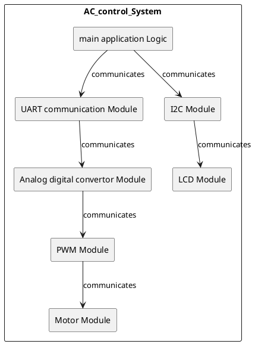
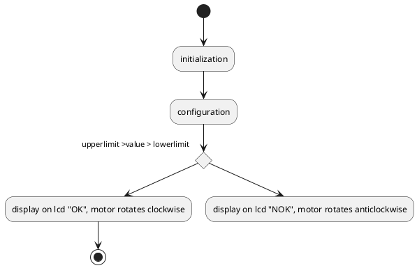
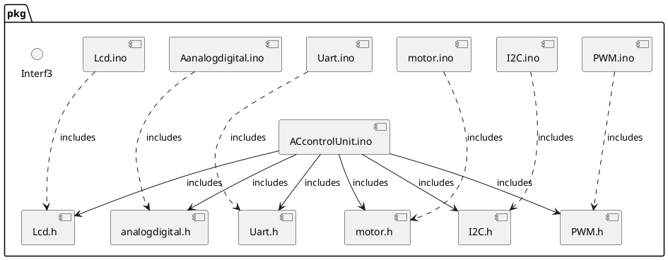

# Detailed Design Document

| **Author**              | `Ahmed Loulou, Sherif Helmy, Youssef Abouelkheir`                                       |
|:------------------------|:-----------------------------------------------------|
| **Status**              | `Inspection`                          |
| **Version**             | `1.0`                                                |
| **Date**                | `07/12/2024`                                         |

## Introduction

The aim from this report is to show the importance of embedded systems and explain how it is going to be used to an automotive air condition system. This project concentrates on detecting temperature values, controlling a fan motor and storing user settings. The following system displays the information on a 16*2 LCD screen, and it gives the user the ability to change its parameters by using a keypad. The purpose of this project is to assemble an efficient climate control system where the temperature can be displayed and saved, the direction of the fan can be changed in addition to its speed, and the parameters of the circuit will be present on the LCD. To realize all of this the system requires the usage of a keypad to set the limits of the temperature, a motor to have control over the fan and EEPROM to save the settings. The following parameters like the temperature and the state of the fan will be shown on the LCD. We used the C programming language to achieve this project in addition to it we used Uart and I2C communication, PWM module to control speed and analog digital conversion system. This circuit is based on real air conditioning systems found vehicles, highlighting the usage of embedded systems for practical applications. For example, the fan motor control of this project is near the airflow direction and speed of modern vehicles. The temperature settings and display are like the ones found in our everyday climate control systems, making this project a near eq~uivalent demonstration of how this technology works.

### Purpose
This low-level design specification describes the internal structure and the functions of the software module. It describes the interaction, data structures, specific embedded constraints and background information about design. This specification is the basis for coding and is an input document for the corresponding module test specification. The terms Low-level design specification and module specification are used interchangeably in Valeo to refer to documents of this type.

### Scope
This report describes how an Arduino-based system works and how it was designed. The system uses a potentiometer as an analogue input, an LCD as an output display, and buttons to change the upper and lower limit ranges on the fly. The potentiometer gives an analogue signal to the Arduino. The built-in ADC turns the signal into a digital value, which is then shown on a 16x2 LCD. The system lets users set these movable limits and see them along with the sensor's current value. This lets them model real-world uses like controlling the temperature or dimming the lights. This file is a basic outline for the software's framework, how its parts work together, and any built-in restrictions. It will help with future development and testing.

## Architectural Overview

This section describes where this module resides in the context of the software architecture

### Assumptions & Constraints
Indicate constraints of the low level design and any assumptions appropriate for the design.

## Functional Description
This code takes the value of an analogue sensor, compares it to upper and lower limits that can be set, and shows the result on an LCD screen. It sets up the ADC, UART, and LCD modules and their starting values for upperlimit and lowerlimit after setting up certain pins as inputs with pull-up resistors for buttons. The code reads the sensor value from the ADC, turns it into a string, sends it over UART, and shows the string along with the current limits on the LCD in the main loop. Users can change these limits on the fly by pressing buttons. The code turns off an LED and displays "OK" on the LCD if the sensor reading is within the range given. If it's not, it turns on the LED and displays "NOK." This shows how to watch and control an analogue input in real time with thresholds that can be changed.

## Implementation of the Module
This project uses Arduino to show analog-to-digital conversion (ADC) and display the digital signal on an LCD with changeable limit ranges via buttons. An analogue potentiometer, an LCD screen to show data, buttons for interactive range limit control, and an LED for feedback are the main hardware components. The Arduino's ADC digitises the potentiometer's analogue variable input signal. This digital reading and user-defined upper and lower limits are shown on a 16x2 LCD screen in real time.

The system continuously reads the potentiometer's output and checks for limitations using the ADC. Four buttons let users dynamically alter these limits: two for the higher limit and two for the lower limit. A normal state is indicated by a "OK" LCD message and an off LED when the sensor reading is within the defined range. The LED and "NOK" message inform the user if the reading is outside this range.

This configuration simulates real-world control systems. In a heating or cooling system, the potentiometer could replicate a thermostat dial and the ADC would transform the temperature setting into a digital display. In this example, the LCD would display the specified temperature and safe or desirable limits in real time. The potentiometer might be a dimmer switch for lighting control, with the ADC converting brightness levels into LCD percentages. The dynamic change of limits in both examples shows how users can interactively control and monitor analogue values in digital formats.

This paper describes each software module's structure and functions as a low-level design specification. The system's underlying workings are explained by covering component interactions, embedded data structures, and design limitations. This design document establishes each component's functionality and role in the system, guiding coding and testing.

## Integration and Configuration
### Static Files
Typically a module consists of C and H files but other file types may exist. List all files that form this module

| File name | Contents                             |
|-----------|--------------------------------------|
| ACcontrolUnit.ino   | Includes the main code for the apllication |
| analogdigital.h | header for adc functions        |
| Aanalogdigital.ino | Includes all adc functions and initlization         |
| LCD.h     | header for lcd functions                |
| LCD.ino    | Includes all Lcd functions and initlization                |
| Uart.h    | header for uart communications functions |
| Uart.ino   | Includes all uart communications functions and initlization |
| I2C.h | header the inisialization of the I2C communication       |
| I2C.ino | include all functions required in the I2C        |
| PWM.h | header for the PWM functions        |
| PWM.ino | includes all pwm functions required     |
| Motor.h | header for the motor functions        |
| Motor.ino | includes all motor functions required to make the motor spin       |
### Include Structure

If there is a complex file structure e.g. more than one c-file or more than two h-files use a diagram to explain the relationship between the source and dependent include files.

### Configuration
Any required hardware/software or system configuration that can be adjusted a header file shall be detailed in this section. This can be placed in the table below.
| Name | Value range | Description |
|------|-------------|-------------|
|   limit   |     lowerlimit - upperlimit        |     Uses upper and lower limit to create a range        |
|   lowerlimit   |     loweraddress        |   uses the eeprom memory to store the value of the limit        |
|   upperlimit   |     upperaddress        |   uses the eeprom memory to store the value of the limit        |
|   Baudrate  |     9600       |     sets the baudrate       |
|   F_CPU  |     16 MHz       |    sets the CPU clock frequency for I2C communication      |
|   SCL_CLOCK  |     100 kHz       |     sets the clock speed for the I2C communication "frequency of the SCL line"       |
|   refrenceVoltage  |     500      |     used in calculations of temperature from the sensor      |
|   MotorSpeed  |     255       |     sets the speed of the motor       |
